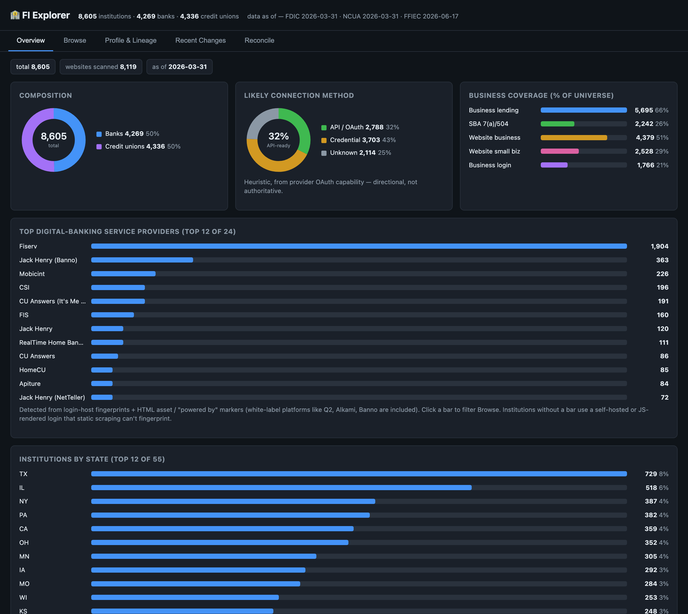

# fi-lookup-mcp

[](https://github.com/nlsnnvas/fi-lookup-mcp/actions/workflows/ci.yml)
[](LICENSE)
[](.python-version)

A personal portfolio project demonstrating a **tool-use, reconciliation, and lineage-tracing pattern** over public regulatory data, implemented as a local MCP (Model Context Protocol) server. It speaks stdio, so it works with any MCP host — **Claude Code** (CLI) and Claude Desktop are both supported.

Built by Nelson Anievas, with development assisted by **Claude Code**. Public data only — no proprietary or employer systems involved.

---

## What It Does

This server exposes 11 tools that allow an AI agent to resolve, enrich, and track the history of US financial institution records using canonical regulatory identifiers from FDIC, NCUA, and FFIEC public datasets.

The server handles three distinct patterns:

- **Reconciliation**: given a dirty external record (e.g. `"Mtn America FCU, Sandy UT"`), return ranked candidate matches with confidence scores and match reasons
- **Lineage tracing**: given an RSSD ID, return the full merger, acquisition, rebrand, and consolidation history — predecessors, successors, parent company, and subsidiaries — with real names resolved across 223,750 active and historical institutions
- **Change feed**: return all transformation events (mergers, failures, rebrands, splits) within a configurable lookback window, filterable by institution type, event type, and state — for dataset maintenance and regulatory monitoring

It also ships with **FI Explorer**, a local web dashboard over the same data — no MCP client required:



> The Overview tab. Charts are dependency-free inline SVG; provider and state bars are click-to-filter. See [Web dashboard (FI Explorer)](#web-dashboard-fi-explorer).

---

## Tools

### `search_institutions`
Free-text name search across all FDIC banks and NCUA credit unions. Supports filtering by institution type and state. Returns ranked candidates with fuzzy match scores.

### `get_institution_profile`
Full regulatory profile lookup by any identifier — FDIC cert, NCUA charter number, or RSSD ID. Returns all available metadata including regulator, charter type, ABA routing number, deposit account count, and web address.

### `reconcile_institution`
The centerpiece reconciliation tool. Takes a messy external record (name, optional city/state/identifier) and returns ranked candidate matches, each with a confidence score (0–1) and human-readable match reasons.

Scoring blends:
- **Name similarity** (0.6 weight): token-set ratio + Jaro-Winkler, with abbreviation expansion (FCU → federal credit union, Mtn → mountain, N.A. → national association)
- **Geographic agreement** (0.4 weight): state match (0.6) + city match (0.4)
- **Exact identifier override**: if a cert, charter, or RSSD is provided and matches, confidence is set to 1.0

### `crosswalk_identifiers`
Translates between FDIC cert, NCUA charter number, and RSSD ID. Explains regulatory boundaries (e.g. why a credit union has no FDIC cert).

### `get_institution_history`
Returns the full merger, acquisition, and rebrand lineage for any institution by RSSD ID. Resolves real names for both active and defunct predecessor/successor institutions using a 223,750-record historical name lookup built from FFIEC NIC active and closed attributes files. Includes parent company and subsidiary relationships.

Example output for JPMorgan Chase (RSSD 852218): 52 predecessors including Washington Mutual (FDIC-assisted, 2008), Bank One (merger, 2004), and Bear Stearns entities — all with resolved names and dates.

### `get_recent_changes`
A configurable regulatory change feed built from FFIEC NIC Transformations data. Returns mergers, failures, rebrands, splits, and other structural events within a lookback window. Useful for identifying institutions that have changed status and may need dataset updates.

Each event carries the **full metadata** of both the predecessor and successor (name, type, regulator, city/state, FDIC cert / NCUA charter, ABA routing, deposit accounts, web address). For every predecessor with a portal on record, the tool also **fetches its home/login URL** and classifies whether it is still operating independently or has been consumed by the acquirer:

- `independent_portal_live` — still served on its own domain
- `consumed_by_acquirer` — redirects to the acquirer's domain
- `redirects_elsewhere` — redirects to a third domain (rebrand/division site)
- `unreachable` — portal did not respond (likely retired)

Portal checks run concurrently and are reported in a `portal_summary` tally. Lookups use a one-time RSSD index (O(1)), so the data-only path is near-instant; portal checks are the only network cost and can be tuned or disabled.

Parameters:
- `days`: lookback window (default 365, max 3650)
- `institution_type`: `"bank"`, `"cu"`, or `"all"`
- `event_type`: `"merger"`, `"failure"`, `"split"`, `"rebrand"`, or `"all"`
- `state`: optional 2-letter state filter
- `check_portals`: fetch and classify predecessor portals (default `true`; set `false` for an instant data-only feed)
- `max_portal_checks`: cap on portals fetched, most-recent first (default 50)

### `get_top_institutions`
Returns the top N institutions ranked by deposit account count, with individual and cumulative market share percentages. Supports filtering by institution type.

### `export_institutions`
Exports the full institution dataset to a CSV file with configurable filters, sorting, and market share calculations.

### `list_institutions`
General-purpose browse/query tool over the **complete** FDIC + NCUA dataset, exposing **all 33 metadata fields** per institution (every other tool returns a trimmed projection). One tool that is searchable, filterable, sortable, and exportable:

- **Search**: case-insensitive substring across any subset of fields (`search_fields`, or `"all"`)
- **Filter**: institution type; state (input accepts `UT` *or* `Utah`; output is always the canonical 2-letter code); min/max deposit accounts; `has_routing`, `has_rssd`, `has_history`; and the business/provider signals `business_lending`, `sba_lender`, `website_business`, `website_small_business`, `business_login`, `service_provider`, `connection_method`, `oauth_network`
- **Sort**: any field, ascending or descending (numeric fields sort numerically)
- **Page**: `limit`/`offset` with `has_more`/`next_offset` for inline browsing; `fields` projects a subset
- **Export**: set `export_path` to write **all** matched rows (not just the page) to `csv` or `json`; bare filenames default under `~/Desktop`, written atomically

The **33 fields** span four groups: *identity* (name, city, state, regulator, cert/charter, RSSD, routing, deposits, web address), *NIC lineage* counts, *business coverage* (`business_lending`, `sba_lender`, `website_business`, `website_small_business`, `business_login_portal`), and *inferred provider / open-finance* signals (`service_provider`, `likely_connection_method`, `oauth_networks`, `connection_basis`).

The last two groups are **directional, not authoritative**: lending ≠ deposit accounts; website + provider signals are best-effort scrapes (JS-only login widgets read as `unknown`); OAuth rails reflect the provider's public FDX/Akoya/PCX capability, not a per-institution guarantee.

### `refresh_cache`
Rebuilds the local data snapshot from scratch — re-fetches FDIC data from the BankFind API (latest quarter auto-discovered), auto-downloads the newest NCUA quarterly ZIP, and re-reads the local FFIEC ZIPs. Runs the full NIC enrichment pipeline. Reports the `data_as_of` date for each source.

### `refresh_if_changed`
Cost-effective conditional refresh: fingerprints all sources (FFIEC ZIP content hashes + latest FDIC/NCUA quarter) and rebuilds **only when something actually changed**, otherwise skips the expensive reprocessing and returns `changed: false`. This is the tool the monthly scheduler runs — see [Scheduled updates](#scheduled-updates).

---

## Data Sources

All data is public regulatory data. No licensed or proprietary sources.

| Source | Data | Refresh |
|--------|------|---------|
| FDIC BankFind API | ~4,269 active banks: name, location, cert, RSSD, web address | API call |
| FDIC Financials API | Deposit account counts + business lending (LNCI/LNCOMRE), most recent quarter | API call |
| NCUA Quarterly ZIP | ~4,336 active credit unions; deposits (FS220A); web (FS220D); member-business loans (FS220/FS220L) | Auto-download |
| SBA 7(a)/504 FOIA | Small-business lenders, joined by FDIC cert / NCUA charter (7a) or name (504) | `refresh_sba.py` (quarterly) |
| Institution websites | Advertised business / small-business accounts + separate business login portals | `scrape_business_coverage.py` (delta-driven) |
| FFIEC NIC Active Attributes | ABA primary routing numbers; joined via RSSD/cert/charter | Manual download |
| FFIEC NIC Closed Attributes | Historical institution names for 161,950 defunct entities | Manual download |
| FFIEC NIC Transformations | 59,071 merger/acquisition/rebrand/failure events | Manual download |
| FFIEC NIC Relationships | Parent/subsidiary/branch ownership structure | Manual download |

**Total universe: 8,605 active institutions + 223,750 name-resolved historical records**

---

## Architecture

```text
        Claude Code  /  Claude Desktop      (any MCP host)
                          |
                          |  MCP stdio transport
                          v
                 server.py  (FastMCP 3.4.2)
                          |
   +-- search_institutions
   +-- get_institution_profile
   +-- reconcile_institution      -->  reconciler.py
   +-- crosswalk_identifiers
   +-- get_institution_history    -->  nic_names lookup (223,750 records)
   +-- get_recent_changes         -->  CSV_TRANSFORMATIONS.zip
   +-- get_top_institutions
   +-- export_institutions
   +-- list_institutions          -->  full dataset: search / filter / sort / export
   +-- refresh_cache              -->  full rebuild (FDIC live + NCUA auto-dl + FFIEC)
   +-- refresh_if_changed         -->  conditional rebuild (monthly launchd job)
                          |
                          v
   data_loader.py  +  nic_loader.py  +  sba_loader.py  +  business_classifier.py
                          |
                          +-- cache/fdic_institutions.json   (NIC-enriched)
                          +-- cache/ncua_institutions.json   (NIC-enriched)
                          +-- cache/business_coverage.json   (website / provider scrape)
                          +-- cache/sba_lenders.json         (SBA 7(a)/504 index)
                          +-- cache/call-report-data-*.zip
                          +-- cache/CSV_ATTRIBUTES_ACTIVE.zip
                          +-- cache/CSV_ATTRIBUTES_CLOSED.zip
                          +-- cache/CSV_TRANSFORMATIONS.zip
                          +-- cache/CSV_RELATIONSHIPS.zip
```

Also reading the same snapshot: **`web_app.py`** (the FI Explorer web dashboard)
and **`build_release.py`** (the CSV / SQLite / Parquet release export).

Key design decisions:
- **Local cache first**: runs fully offline after initial build; warm start skips live API calls
- **NIC enrichment at save time**: predecessor/successor/parent/subsidiary fields are written into the JSON cache so subsequent warm starts load enriched data instantly
- **Atomic cache writes**: `.tmp` rename pattern prevents corruption on interrupted writes
- **Stderr-only logging**: never pollutes the MCP stdio JSON channel
- **Abbreviation-aware normalization**: improves recall on dirty external records

---

## Local Data Setup

The `cache/` directory is **not committed to Git** — populate it manually before first run.

### Required downloads

| File | Source |
|------|--------|
| `cache/CSV_ATTRIBUTES_ACTIVE.zip` | [FFIEC NIC Data Download](https://www.ffiec.gov/npw/FinancialReport/DataDownload) — Active Attributes |
| `cache/CSV_ATTRIBUTES_CLOSED.zip` | [FFIEC NIC Data Download](https://www.ffiec.gov/npw/FinancialReport/DataDownload) — Closed Attributes |
| `cache/CSV_TRANSFORMATIONS.zip` | [FFIEC NIC Data Download](https://www.ffiec.gov/npw/FinancialReport/DataDownload) — Transformations |
| `cache/CSV_RELATIONSHIPS.zip` | [FFIEC NIC Data Download](https://www.ffiec.gov/npw/FinancialReport/DataDownload) — Relationships |

**FDIC** is fetched live from the [FDIC BankFind API](https://banks.data.fdic.gov/docs/) (latest quarter auto-discovered) and **NCUA** quarterly ZIPs are now **auto-downloaded** — neither needs a manual download. Only the four **FFIEC NIC** ZIPs above must be placed in `cache/` by hand, because FFIEC's bulk download is gated against scripted requests.

---

## Scheduled updates

Each record carries a `data_as_of` date, and the snapshot keeps itself current with a cost-aware refresh strategy:

- **FDIC / NCUA** — auto-fetch the newest published quarter on every refresh.
- **FFIEC** — refreshed by dropping new ZIPs into `cache/` (the bulk download is 403-gated to scripts, so it can't be auto-pulled). A content hash detects the change.
- **`refresh_if_changed`** rebuilds **only when a source actually changed**; a no-op run does cheap fingerprint checks (~0.3s CPU) and skips the expensive NIC reprocessing.

A **monthly launchd job** runs `scheduled_refresh.py` (which calls `refresh_if_changed`) at 03:00 on the 1st, logging to `cache/refresh.log`.

### launchd agents

Templates live in [`launchd/`](launchd/) with a `__FI_LOOKUP_DIR__` path placeholder. Install by substituting the absolute repo path (run these from the repo root):

```bash
# Monthly conditional refresh (runs at 03:00 on the 1st)
sed "s#__FI_LOOKUP_DIR__#$(pwd)#g" launchd/com.fi-lookup.monthly-refresh.plist \
  > ~/Library/LaunchAgents/com.fi-lookup.monthly-refresh.plist
launchctl bootstrap gui/$(id -u) ~/Library/LaunchAgents/com.fi-lookup.monthly-refresh.plist

# FI Explorer dashboard as a service (auto-start on login, relaunch on crash/sleep)
sed "s#__FI_LOOKUP_DIR__#$(pwd)#g" launchd/com.fi-lookup.dashboard.plist \
  > ~/Library/LaunchAgents/com.fi-lookup.dashboard.plist
launchctl bootstrap gui/$(id -u) ~/Library/LaunchAgents/com.fi-lookup.dashboard.plist
```

Manage either agent (`<label>` = `com.fi-lookup.monthly-refresh` or `com.fi-lookup.dashboard`):

```bash
launchctl kickstart -k gui/$(id -u)/<label>   # run / restart now
launchctl bootout   gui/$(id -u)/<label>       # stop + unload
```

Recommended refresh cadence: **monthly** (bump to weekly only if you depend on the merger change-feed being current within days). The guard makes extra runs nearly free, so erring toward more frequent checks costs little.

---

## Setup

### Prerequisites
- Python 3.11+
- An MCP host — [Claude Code](https://claude.com/claude-code) (CLI) or Claude Desktop

### Install

```bash
git clone https://github.com/nlsnnvas/fi-lookup-mcp.git
cd fi-lookup-mcp
python -m venv .venv
source .venv/bin/activate
pip install -r requirements.txt
```

### Download manual data files

Download the five ZIPs listed in the table above and place them in `cache/`. FFIEC files are available at [ffiec.gov/npw/FinancialReport/DataDownload](https://www.ffiec.gov/npw/FinancialReport/DataDownload).

### Build the data snapshot

```bash
python -c "import asyncio; from data_loader import build_snapshot; asyncio.run(build_snapshot())"
```

This fetches FDIC data live, reads all local ZIPs, runs NIC enrichment, and writes the JSON cache. Expect 2–3 minutes on first run.

### Run the tests (optional)

```bash
pip install -r requirements-dev.txt
python -m pytest -q
```

The suite (`tests/`) is **hermetic** — it covers the deterministic core (reconciliation scoring, state canonicalization, provider classification incl. the MeridianLink false-positive guard) and two convention guards (no-stdout, tools-don't-throw-on-empty-snapshot), so it needs no snapshot, network, or data ZIPs. CI runs it on every push.

### Connect to an MCP host

**Claude Code** (CLI) — register the server with the venv interpreter:

```bash
claude mcp add fi-lookup -- "$(pwd)/.venv/bin/python" "$(pwd)/server.py"
```

Verify it loaded with `claude mcp list`, then the tools are available in any `claude` session in that scope.

**Claude Desktop:**

```bash
fastmcp install claude-desktop server.py --name "fi-lookup"
```

Then restart Claude Desktop.

---

## Web dashboard (FI Explorer)

A local web UI over the same dataset and tools — no MCP client required. Built with Starlette + uvicorn (both ship with FastMCP, so **no extra dependencies**).

```bash
python web_app.py                 # serves http://127.0.0.1:8765
python web_app.py --port 9000     # custom port
```

Five tabs:
- **Overview** — headline metrics plus dependency-free inline-SVG charts (composition donut, likely-connection-method donut, business-coverage bars, top service providers, institutions-by-state), and a top-N market-share table (wraps `get_top_institutions`). Provider and state bars are click-to-filter into Browse.
- **Browse** — searchable / filterable / sortable table over all institutions with every metadata field, plus CSV/JSON export (wraps `list_institutions`). Filters include `business lending`, `SBA`, `website business`, `website small biz`, `service provider`, and **`business login`** (institutions with a separate business sign-in — multiple aggregation entry points)
- **Profile & Lineage** — enter an RSSD ID for merger/acquisition lineage: predecessors, successors, parent, subsidiaries (wraps `get_institution_history`)
- **Recent Changes** — merger/failure/rebrand/split feed with optional portal verification, independent-vs-consumed (wraps `get_recent_changes`)
- **Reconcile** — paste a messy record for ranked candidate matches with confidence scores (wraps `reconcile_institution`)

The active tab and Browse filters encode into the URL, so a specific view (e.g. `business login = yes`) is shareable by link.

It is **read-only and bound to `127.0.0.1` (localhost only)** by default.

### Sharing it safely (LAN demo)

Opt-in hardening via environment variables — all off by default for local use:

```bash
FI_AUTH_USER=demo FI_AUTH_PASS=s3cret \
FI_DISABLE_PORTAL_CHECKS=1 \
FI_RATE_LIMIT_PER_MIN=240 \
python web_app.py --host 0.0.0.0      # reachable at http://<this-machine-ip>:8765
```

- `FI_AUTH_USER` / `FI_AUTH_PASS` — require HTTP basic auth on all routes (constant-time check); `/healthz` stays open.
- `FI_RATE_LIMIT_PER_MIN` — per-IP request cap (default 240; 0 disables).
- `FI_DISABLE_PORTAL_CHECKS` — turn off the outbound portal-verification fan-out (otherwise hard-capped by `FI_MAX_PORTAL_CHECKS`, default 60) so an exposed instance can't be used to spray third-party requests.

The server prints its security posture on startup and warns if bound to a non-localhost interface with no auth. For internet exposure (not just a trusted LAN), additionally put it behind HTTPS/a reverse proxy.

---

## Example Interactions

**Reconciliation:**
> "I have a vendor row that says 'Mtn America FCU, Sandy UT' — what is it?"

`reconcile_institution` scores ~8,605 institutions and returns Mountain America Credit Union (NCUA #24692) at 0.984 confidence, with ABA routing, deposit account count, and charter type.

**Lineage tracing:**
> "What is the full acquisition history of Bank of America?"

`get_institution_history` returns 117 predecessor institutions going back to 1960, including the 1998 BankAmerica merger, the 2008 Countrywide acquisition, and the 2009 Merrill Lynch absorption — all with resolved names and dates.

**Change feed:**
> "What bank failures and mergers happened in the last 90 days?"

`get_recent_changes` returns 108 events grouped by type: 1 FDIC-assisted failure, 107 mergers — including Meadows Bank absorbed by AMERICA FIRST Credit Union and two bank-to-credit-union conversions.

---

## Why This Pattern Matters

Financial institution data is notoriously messy. The patterns here are directly applicable to:

- Matching vendor/counterparty records to a canonical institution master
- Tracing merger lineage for compliance, KYC, or data governance
- Building regulatory change feeds for dataset maintenance automation
- Enriching internal datasets with public regulatory metadata
- Onboarding automation that maps free-text institution names to stable IDs

This project re-expresses reconciliation and lineage patterns from production AI agent work, using only public data.

---

## Stack

- Python 3.11
- FastMCP 3.4.2
- rapidfuzz (fuzzy string matching)
- httpx (async HTTP)
- Claude Code / Claude Desktop (MCP host)

---

## Framing Note

This is a **tool-use, reconciliation, and lineage-tracing pattern** — not RAG. The model calls structured tools that execute deterministic scoring and lookup logic against a pre-built regulatory snapshot and return ranked, explainable results. The NIC enrichment pipeline runs at startup and writes enriched data to the JSON cache, so subsequent tool calls are fast in-memory lookups.
